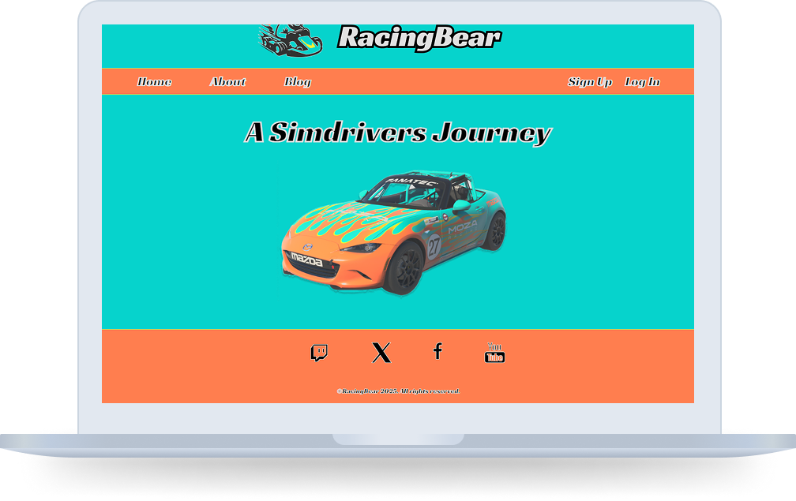

# 🏎️ RacingBear  
  

A high-speed racing-themed web page built with **HTML, CSS, and JavaScript**, featuring real-time data interaction through APIs.  

## 📖 Description  
RacingBear is a web page designed for racing enthusiasts, featuring real-time data and interactive elements. The goal of this project was to create a **visually engaging and dynamic racing-themed website** that interacts with APIs to fetch and display relevant racing data. Built with **HTML, CSS, and JavaScript**, this project delivers a smooth, responsive, and exciting user experience.  

### 🔹 Features  
- API integration for real-time racing data  
- Interactive UI with smooth animations  
- Fully responsive and optimized for all devices  
- Fast performance and efficient rendering  

---

## 🛠️ **Built With**  
- **HTML5**  
- **CSS3**  
- **JavaScript (ES6)**  
- **REST APIs**  

---

## 🚀 **Getting Started**  

### 📥 Installing  
To get a local copy up and running, follow these steps:  

1. Clone the repository:  
   ```sh
   git clone https://github.com/yourusername/racingbear.git
2. Open the index.html file in your preferred browser.

---

## ▶️ Running the Project
Since this is a static HTML, CSS, and JavaScript project, no additional setup is required. Simply open the index.html file in your browser.

---

## 🤝 Contributing
Contributions are welcome! If you’d like to contribute:

Fork the repository
1. Create a new branch (git checkout -b feature-branch)
2. Commit your changes (git commit -m 'Add new feature')
3. Push to the branch (git push origin feature-branch)
4. Open a Pull Request

---

## 📬 Contact
Feel free to reach out through:

[](https://linkedin.com/in/bjørn-thomas-torvund-723189a7)
[](https://twitter.com/thomastorvund)
[](mailto:bjorn.thomas.torvund@gmail.com)

